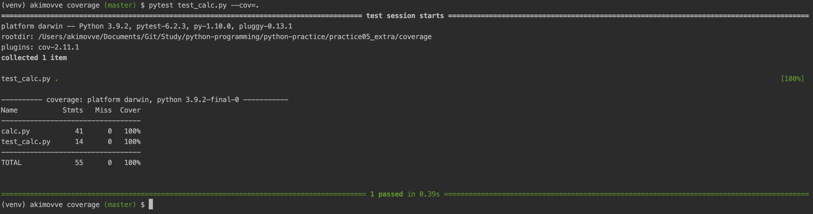

# Practice 5 extra. Testing

## Table of Contents

- [Doctest](#doctest)
- [Pytest](#pytest)
- [Coverage](#coverage)
- [Mutmut](#mutmut)
- [Deal](#deal)
- [Hypothesis](#hypothesis)

### Doctest

Here is the content of docstring

```bigquery
>>> p1(2, 2, 2)
'Равносторонний'
>>> p1(3, 4, 5)
'Разносторонний'
>>> p1(2, 3, 2)
'Равнобедренный'
>>> p1(1, 2, -1)
'Сторона не может быть меньше 0'
>>> p1(1, 2, 1)
'Такого треугольника не существует'
```

Write command ```python3 -m doctest -v doctest_module.py```


### Pytest

Write command ```pytest pytest_module.py```


### Coverage

1. Write command ```pytest test_calc.py --cov=.```



2. Write command ```pytest test_calc.py --cov=. --cov-branch```

__Code__

```bigquery
def test_calc():
  for _ in range(1):
    start(gen())
```

Output: __51% coverage__


3. Write command ```pytest test_calc.py --cov=. --cov-branch```

__Code__

```bigquery
def test_calc():
  for _ in range(10000):
    start(gen())
```

Output: __100% coverage__


3. Write
   command ```pytest test_calc.py --cov=. --cov-branch --cov-report=html```


### Mutmut

### Deal

### Hypothesis

